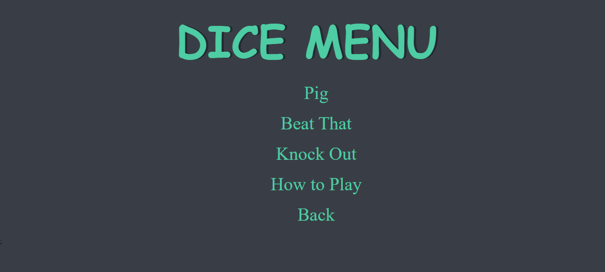

# Dice
This project is a collection of three very simple dice games. They are called “pig”, “beat that” and “knock out”. 

## Introduction
I made this project while I am taking Udemy course called “The complete 2021 Web Development bootcamp”. I got the skeleton project form the course and I made beautiful game. 

A dice is a small cube which has between one and six spots or numbers on its sides. They are used for generating random number.

## Technologies
* HTML5
* CSS3
* JavaScript

## Lunch
github page link : https://natnaelpro.github.io/Dice/

## General info
### Dice games are popular for a number of reasons, among them
* Dice games are versatile as they can be played anywhere with people of any age.
* Dice games are educational.
* Dice games teach numbers and counting to little kids.
* Dice games introduce kids to strategic thinking and planning. 
* Dice games are fun!

In this project there three dice games.

### 1. PIG
**Pig** is a simple dice game. Players take turns to roll a single die as many times as they wish, adding all roll results to a running total, but losing their gained score for the turn if they roll a 1.  

Even though the directions make this game sound easy, unless you are good at throwing 1s, this game may be hard for to play. The game is called “Pig” because the first player “hogs” the dice in an effort to win the game.  

**Dice need:** 1  

**Object of the game:** To score 100 points  

#### How to play PIG
Each turn, a player repeatedly rolls a die until either a 1 is rolled or the player decides to "hold":
* If the player rolls a 1, they score nothing and it becomes the next player's turn.
* If the player rolls any other number, it is added to their turn total and the player's turn continues.
* If a player chooses to "hold", their turn total is added to their score, and it becomes the next player's turn.
* The first player to score 100 points wins.

### 2. Beat That!
A good game for introducing your kids to the fun of dice games, this easy to learn game is one that is very popular with kids. It is sure to become a family favorite!  

**Dice need:** 2  

**Object of the game:** To score highest at the end of 10 rounds.  

#### How to play Beat That
A good game for introducing your kids to the fun of dice games, this easy to learn game is one that is very popular with kids. It is sure to become a family favorite!

### 3. Knock Out!
Knock Out is another easy dice game that needs only two dice.  

**Dice need:** 2  

**Object of the game:** To score highest at the end of 10 rounds. 

#### How to play knock out 
To play Knock Out, every player rolls two dice. The dice are then added together. That sum is the score unless it was a 7. When a sum of seven is rolled, not only does the player not score for that round, but all of the players scores up to that point are knocked out leaving a score of 0.  

That player will have to start over again at 0.  

## Screenshot 

